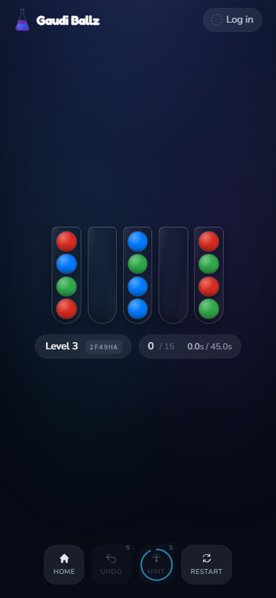

# Gaudi Ballz
[](https://github.com/Dirnei/gaudiballz/actions/workflows/ci.yml)
[](https://gaudiballz.leberkas.org/)
[](https://ko-fi.com/dirnei)

A browser-based colour-sorting puzzle game. Sort the balls into flasks to clear the board.



## Features

- Procedurally generated levels with increasing difficulty
- Undo, hints, and restart
- Leaderboard and personal stats
- Activity feed
- Installable as a PWA

## Tech Stack

- **Frontend**: React 19, TypeScript, Tailwind CSS 4, Vite, Framer Motion
- **Backend**: .NET 10 / C#
- **Database**: MongoDB
- **Deployment**: Docker

## Getting Started

```bash
docker compose up -d --build
```

The app runs at `http://localhost:8123`.
